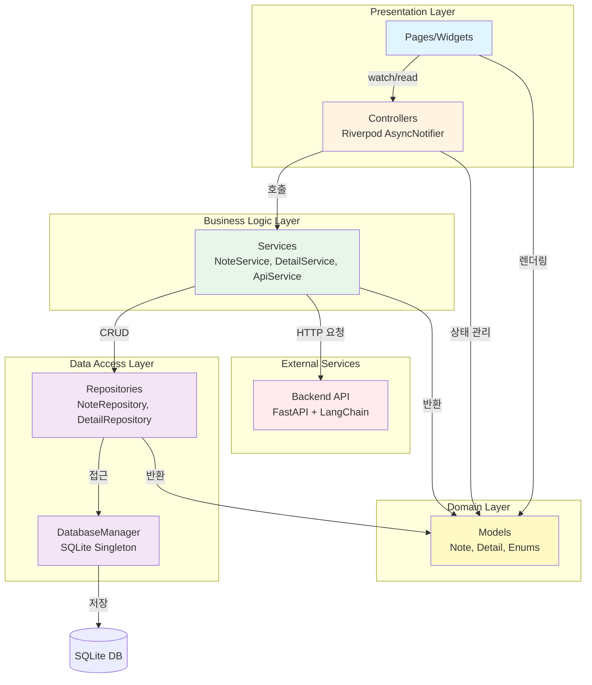

# madcamp_w1_coffee_note

MADCAMP Week 1!

목차
1. 깃헙 다운로드해서 실행해보는 방법
  1) 사전 요구사항
     - Flutter SDK 3.10.4 이상 설치 필요
     - Android Studio 또는 VS Code 설치
     - Android/iOS 에뮬레이터 또는 실제 기기 연결
  2) 설치 및 실행 방법
     ```bash
     # 저장소 클론
     git clone https://github.com/latte0415/MADCAMP-W1-Coffee-Note.git
     cd MADCAMP-W1-Coffee-Note
     
     # 의존성 패키지 설치
     flutter pub get
     
     # 앱 실행 (에뮬레이터 또는 실제 기기 연결 후)
     flutter run
     ```
  3) 주요 의존성 패키지
     - `sqflite`: SQLite 데이터베이스
     - `flutter_riverpod`: 상태 관리
     - `dio`: HTTP 클라이언트 (백엔드 API 호출)
     - `image_picker`: 이미지 선택 기능
     - `path_provider`: 파일 시스템 경로 처리
     - `uuid`: UUID 생성

2. 어떻게 시작 했는지
  1) 주어진 공통 과제 내용
    - ## **공통과제 I : 탭 구조를 활용한 안드로이드 앱 제작**
        - 목적: 서로 함께 공통의 과제를 함으로써, 개발에 빠르게 익숙해지기
        - 결과물: 다음과 같은 세 개의 탭이 존재하는 안드로이드 앱(세 개 보다 많아도 무관합니다) 
            | 탭1 | 리스트 형태의 페이지
            예시) 연락처(휴대폰의 연락처 데이터를 활용하거나, JSON 형식을 이용해서 임의의 연락처 데이터를 구축), 상품 리스트, 맛집 리스트 등등
            
            추천: [ListView](https://developer.android.com/reference/android/widget/ListView.html)나 [RecyclerView](https://developer.android.com/guide/topics/ui/layout/recyclerview) 등을 이용해서 데이터 보여 주기 |
            | --- | --- |
            | 탭2 | 나만의 이미지 갤러리 구축.
            대략 20개 이상의 이미지 필요. |
            | 탭3 | 자유 주제 |
        - 첫날 해야 하는 일 추천: [Android Studio](https://developer.android.com/studio) 설치하기 / Hello World 띄워 보기
        - 과제 중 추가로 해야 할 일: 협업을 위한 도구 사용
            - Git에 대한 이해도 높이기
            - [github.com](http://github.com/)에서 public 프로젝트로 운영하는 것을 권고
            (실제로 현업에서 많이 사용되기 때문에 그러함)
  2) 아이디어 브레인스토밍 및 구체화
    - 노션 활용
    - 리스트, 갤러리를 활용하기 위해 기록이라는 기능에 집중.
    - 공통 관심사 중 커피를 다뤄보기로 함
    - 지점/카페/원두마다 다른 커피의 맛을 기록해두고, 그때그때 원하는 커피를 찾을 수 있게 하자라는 목표를 설정
  3) 기능 명세
    - 향, 맛을 초보자에게도 직관적으로 보여줄 수 있는 요소가 필요
    - 정보 중심(카페, 날짜, 텍스트 등)으로 조회하는 방법과 시각적 기억 중심(사진)으로 조회하는 방법 각각을 2개의 탭으로 설정
    - 마지막 3번째 탭에서는 사용자가 원하는 향과 맛에 맞는 커피를 찾아주는 기능을 구현하고자 함.

3. 상세 기획
- 기능 명세에 맞게, IA, UI 프레임워크, DB 스키마를 우선 구현함
- Figjam 사용 (추후 관련 이미지 첨부 예정)
1) DB 스키마
- 초보자에게 직관적으로 보여줄 수 있는 향,맛으로 산미/바디/쓴맛을 1~10 레벨 개념으로 정의함
- 두 개의 테이블로 구성: `notes` (기본 정보), `details` (상세 정보)

**notes 테이블**
- id: TEXT, PK (UUID)
- location: TEXT NOT NULL (카페 이름)
- menu: TEXT NOT NULL (메뉴명)
- level_acidity: INTEGER NOT NULL (1~10)
- level_body: INTEGER NOT NULL (1~10)
- level_bitterness: INTEGER NOT NULL (1~10)
- comment: TEXT NOT NULL (한줄평)
- image: TEXT (이미지 경로, nullable)
- score: INTEGER NOT NULL (1~5)
- drank_at: TEXT NOT NULL (유저가 기록한 날짜, 시간은 X)
- created_at: TEXT NOT NULL
- updated_at: TEXT NOT NULL

**details 테이블**
- id: TEXT, PK (UUID)
- note_id: TEXT NOT NULL UNIQUE (notes 테이블 외래키)
- origin_location: TEXT (국가/지역)
- variety: TEXT (품종)
- process: TEXT (가공방식 enum: WASHED, NATURAL, PULPED_NATURAL, HONEY, ETC)
- process_text: TEXT (가공방식 원문)
- roasting_point: TEXT (로스팅포인트 enum: LIGHT, MEDIUM, MEDIUM_DARK, DARK, ETC)
- roasting_point_text: TEXT (로스팅포인트 원문)
- method: TEXT (추출방식 enum: ESPRESSO, FILTER, COLD_BREW, ETC)
- method_text: TEXT (추출방식 원문)
- tasting_notes: TEXT (테이스팅 노트, JSON 배열 형태로 저장, 최대 5개)


2) IA (이미지 첨부 예정)
- 최대한 뎁스를 낮추기 위해서 3개의 탭을 기본으로 하고, 상세 정보 및 생성하기는 팝업 모달로 기획
3) UI 프레임워크 (이미지 첨부 예정)
- 각 페이지별로 목적, 구성요소, 액션을 정의하고
- Figjam으로 대략적인 프레임워크를 채워나감

4. 개발
1) 스택 선정: 웹은 개발해본 경험이 있기도 하고, 빠르게 개발하기 좋다고 해서 flutter 선정
2) github repository 생성: https://github.com/latte0415/MADCAMP-W1-Coffee-Note
  - 브랜치 전략은 배포가 따로 없기에 main 브랜치를 기준으로 함
  - 기능 구현은 feat, 리팩터링은 refactor, 기타 버그 픽스는 fix 정도로만 간결하게 정리
  - 역할 분담
    - 백엔드 역할을 하는 기능 구현: 라태형
    - 프론트엔드 컴포넌트 및 연결: 장정우
3) 아키텍처링 전략
  - 이전 백엔드 구현 경험에서 참고하여 Layered Architecture 전략 유지
  - 이전: API -> Service -> Repository -> Domain
  - API 없이 바로 프론트엔드가 존재하므로 서비스 메서드를 바로 프론트엔드 레이어인 page 에서 사용하고자 함
  - 또한 repository에서는 database_helper를 통해서 테이블 접근하도록 함
4) 타임라인
  - 1/8: 기획 및 개발 스택 선정, 기본 페이지 구조 구현
  - 1/9: note 테이블에 대한 CRUD 메서드 + 검색/정렬/필터 서비스 구현
  - 1/10: 기획안 수정 + 디자인
  - 1/12: ai 기능 구현 + 디자인 적용
  - 1/13: 리팩터링 + UI 누락된 기능 구현

5. 기획 수정 + 디자인
- 목적 1: 생각보다 시간 여유로움 + 1, 3번째 탭의 공통성이 발견되어 통합하고, 새로운 탭 개설
- 목적 2: 유의미한 구현을 위해 디자인을 진행하기로 함
1) 추가 기능 선정: 사용자가 가장 어려운 건 원두 정보만 보고 향을 추측하는 것. 이걸 ai 통해서 해결하고자 함.
2) 위 내용을 반영하여 figma로 디자인 시작 (아래 이미지 첨부 예정)
3) 역할 배분
  - 라태형: 디자인 및 ai 연결
  - 장정우: 디자인 코드로 마이그레이션 및 해당 프론트엔드 기능 구현 

6. 디자인
- Figma를 활용하여 전체 UI/UX 디자인 시스템 구축
- 디자인 철학: 명확성(Clarity), 일관성(Consistency), 사용성(Usability)을 핵심 가치로 설정

1) 디자인 시스템
- 색상 팔레트
  - Primary Dark (`#2B1E1A`): 주요 텍스트, 버튼 배경, 강조 요소
  - Background (`#FFFFFF`): 화면 및 카드 배경
  - Border (`rgba(90, 58, 46, 0.3)`): 입력 필드 테두리, 구분선
- 타이포그래피
  - 폰트 패밀리: NanumSquareOTF (나눔스퀘어) - 한글 가독성 최적화
  - Large Title: 50px, Weight 700 (Bold) - 화면 제목, 중요한 정보
  - Body Text: 30px, Weight 400 (Regular) - 본문 텍스트, 버튼, 입력 필드
- 간격 및 레이아웃
  - Large Radius: 20px - 버튼, 카드, 해시태그 배경
  - Small Radius: 10px - 입력 필드, 작은 컨테이너
  - 화면 기준: 1080px × 2400px (모바일 세로 방향)
  - 좌우 여백: 49px

2) 주요 화면 구성
- Creation (생성 팝업): 이미지 추가, 텍스트 입력창, 슬라이더(산미/바디/쓴맛), 상세정보 체크박스, 기록하기 버튼
- Library (라이브러리): 검색창, 상세필터(접기/펼치기), 정렬 버튼, 노트 컴포넌트 리스트, FloatingActionButton
- Gallery (갤러리): 이미지 그리드 레이아웃, 노트별 이미지 표시
- AI Guide (AI 가이드): 원두 정보 입력, AI 추천 및 센서리 가이드 제공

3) 컴포넌트 스펙
- Primary Button: 배경 `#2B1E1A`, 텍스트 `#FFFFFF`, Border Radius 20px
- 입력 필드: 배경 `#FFFFFF`, 테두리 `rgba(90, 58, 46, 0.3)`, Border Radius 10px
- 해시태그: 배경 `#2B1E1A`, 텍스트 `#FFFFFF`, Border Radius 20px, 최대 5개
- 노트 컴포넌트: 배경 `#FFFFFF`, 테두리 `rgba(90, 58, 46, 0.3)`, Border Radius 10px

4) 상호작용 패턴
- 하단 내비게이션 바: 항상 표시, 3개 탭 (라이브러리, 갤러리, AI 가이드)
- FloatingActionButton: 모든 화면에서 표시, Creation 팝업 호출
- 팝업 모달: Creation, Detail 화면은 팝업으로 구현 (depth 증가 없음)
- 필터: 검색어 입력 시 실시간 검색, 필터 적용 시 리스트 자동 갱신

7. ai 연결
- 파이썬 FastAPI 백엔드 서버 개설 (Railway 배포)
- Base URL: `https://madcamp-w1-coffee-note-backend-production.up.railway.app`
- 기술 스택: langchain + openai + tavily
  - openai: GPT 모델 사용
  - langchain: 트레이싱 및 에이전트 구현
  - tavily: web search tool (커피 정보 검색)

1) 구현 순서
- chat 기능 테스트: 기본 AI 채팅 기능 구현 및 테스트
- pydantic을 이용한 응답형식 강제: 구조화된 데이터 반환을 위한 스키마 정의
- agent를 이용한 web search tool 결합
  - 응답형식 강제는 chain인 runnable에 대해서만 가능하므로, agent도 함께 사용
- agent를 통해서 1차 테이스팅 노트 + 센서리 가이드 제작 → chain을 통해서 매핑
- 최종적으로 3개의 API 엔드포인트 구현

2) API 엔드포인트
- `GET /health`: 서비스 헬스체크
- `POST /chat`: 일반 AI 채팅 기능
- `POST /chat-for-mapping`: 커피 정보를 구조화된 데이터로 매핑
  - 입력: 커피 정보가 포함된 텍스트
  - 출력: location, variety, process, roasting_point, method, tasting_notes 등 구조화된 데이터
- `POST /chat-for-sensory-guide`: 커피 정보 매핑 + 초보자를 위한 센서리 가이드 제공
  - 입력: 커피 정보가 포함된 텍스트
  - 출력: 매핑 결과 + 센서리 가이드 메시지 (2~3줄)

3) 클라이언트 연동
- Dio 패키지를 통해서 HTTP 요청 처리
- `ApiService`에서 백엔드 API 호출 로직 구현
- 에러 처리 및 응답 파싱 구현

8. 리팩터링
- Stateful widget에서 최적화를 위해서 Riverpod 도입
- 목적: 화면 전체 깜빡임 제거, 검색 과호출 방지, 필터 UX 일관화, 상태 관리 최적화

1) Riverpod 도입 배경
- 기존 StatefulWidget의 한계: setState 호출 시 전체 위젯 트리 리빌드로 인한 성능 저하
- 상태 관리 복잡도 증가: 검색, 필터, 정렬 등 다양한 상태를 효율적으로 관리 필요
- 부분 업데이트 필요: 데이터 유지한 채 로딩 상태만 표시하는 부분 리프레시 구현 필요

2) 리팩터링 전략
- Controller 패턴 도입: AsyncNotifier를 활용한 비동기 상태 관리
  - `LibraryViewData`에 `isRefreshing` 플래그 추가 → 기존 데이터 유지한 채 부분 로딩 표시
  - 모든 업데이트/refresh는 `_runQuery` 템플릿 사용
  - `_runQuery` 템플릿: 이전 데이터 유지 → `isRefreshing=true` 설정 → 서비스 호출 → 성공/실패 처리
- Service 패턴 개선: 검색/정렬/필터 분기와 가공을 Service 단일 진입점에서 처리
- UI 최적화
  - 검색 디바운스: TextField onChanged → 250ms Timer 디바운스 → notifier.updateSearch 호출
  - 필터 정책: 필터 닫을 때 값 초기화, 열 때 값 유지
  - 슬라이더 값 업데이트: onChangeEnd + 디바운스(200ms)
- 구독 원칙
  - `watch(select)`: UI에 필요한 조각만 구독 (searchQuery, sortOption, filterState, notes, isRefreshing 등)
  - `read(notifier)`: 이벤트 핸들러에서만 사용
  - `ref.listen`: build에서 1회 등록해 필터 상태 변화 시 로컬 슬라이더 값 동기화

3) 최종 아키텍처



4) 아키텍처 특징
- **Layered Architecture**: Presentation → Business Logic → Data Access → Domain 계층 분리
- **Repository Pattern**: 데이터 접근 추상화로 데이터 소스 변경 용이
- **Service Layer**: 비즈니스 로직 중앙화 (검색, 정렬, 필터, 유사도 계산)
- **Riverpod State Management**: 
  - Controller(AsyncNotifier)가 비동기 상태와 쿼리 파라미터 관리
  - UI는 필요한 상태만 선택적 구독으로 성능 최적화
  - 부분 리프레시로 UX 개선
- **Singleton Pattern**: DatabaseManager로 단일 DB 인스턴스 관리
- **Dependency Injection**: Riverpod Provider를 통한 의존성 주입

5) 주요 개선 사항
- ✅ 화면 전체 깜빡임 제거: `isRefreshing` 플래그로 부분 로딩 구현
- ✅ 검색 과호출 방지: UI 디바운스(250ms) 적용
- ✅ 필터 UX 일관화: 필터 숨기면 초기화, 슬라이더 onChangeEnd+디바운스
- ✅ 도메인 가공 일괄 처리: Service 단일 진입점에서 검색/정렬/필터 처리
- ✅ 최소 구독 원칙: UI는 select로 필요한 상태만 구독, 이벤트는 read(notifier) 호출

9. 최종 산출물 실행 영상
