# ☕ Coffee Note

> **"커피의 향과 맛, 이제는 기록하고 AI로 가이드 받으세요."**  
> 2025W MADCAMP Week 1 : 탭 구조를 활용한 안드로이드 앱 제작

---
### 목차
1. 프로젝트 소개
2. 주요 기능 (3-Tab Structure)
3. Tech Stack
4. Architecture & Design
5. Database Schema
6. Getting Started
7. Contributors
8. Preview
---
## 프로젝트 소개
**Coffee Note**는 커피 애호가들을 위한 스마트한 기록장입니다. 마신 커피의 특징과 장소를 기록하고, AI 기술을 결합하여 사용자에게 최적의 테이스팅 가이드를 제공합니다.

### 타겟 유저
- 마신 커피의 맛(산미, 바디, 쓴맛)을 직관적으로 기록하고 싶은 분
- 원두의 산지, 품종, 로스팅 포인트 등 상세 정보를 체계적으로 관리하고 싶은 분
- 생소한 원두 정보를 AI를 통해 분석받고 테이스팅 팁을 얻고 싶은 분

---

## 주요 기능 (3-Tab Structure)

본 앱은 MADCAMP 1주차 공통 과제 요구사항에 맞춰 3개의 핵심 탭으로 구성되어 있습니다.

### 1️⃣ Tab 1: Library 
- **커피 노트 리스트**: 기록한 모든 커피 노트를 리스트 형식으로 한눈에 확인합니다.
- **검색 및 필터**: 카페 이름, 메뉴명 검색, 산미/바디/쓴맛 수치별 필터링 기능을 제공합니다. 
- **정렬**: 최신순, 별점순 두가지 기준을 버튼을 통해 선택하여 정렬합니다. 

### 2️⃣ Tab 2: Gallery 
- **시각적 기록**: 커피 사진들만 모아볼 수 있는 그리드 뷰를 제공합니다.
- **사진 기반 접근**: 사진을 클릭하면 오버레이 형식으로 해당 사진이 등록된 노트의 상세 정보가 노출됩니다. 

### 3️⃣ Tab 3: AI Sensory Guide
- **AI 원두 분석**: 원두 이름이나 설명(예: "브라질 워시드 게이샤")만 입력하면 AI가 웹 검색을 통해 산지, 품종, 가공 방식, 로스팅 포인트를 자동으로 찾아줍니다.
- **센서리 가이드**: 해당 커피에서 느껴질 테이스팅 노트(Tasting Notes) 5가지를 추천하고, 초보자를 위한 2~3줄의 테이스팅 팁을 생성합니다.
- **원클릭 기록**: AI가 찾아준 정보를 그대로 내 커피 노트에 이식하여 새로운 노트로 등록합니다.

### 4⃣ Popup: Creation & Detail
- page depth를 고려하여 상세 정보 및 생성하기는 팝업 모달로 구성
- 텍스트 입력, 드롭다운 선택을 통해 노트 정보 기입 및 DB 업데이트 

### Core Interaction & UX
- Floating Action Button: 모든 탭에서 접근 가능한 FAB를 통해 새로운 노트를 추가하는 creation 팝업 연동
- Popup Modal: Page Depth를 최소화하기 위해 creation & detail 정보를 팝업 모달로 구성 
- creation popup: 텍스트 입력, 드롭다운 선택을 통해 노트 정보 기입 및 DB 업데이트
---

## Tech Stack

### Frontend
- **Framework**: Flutter
- **State Management**: Riverpod (AsyncNotifier를 통한 최적화)
- **Local DB**: SQLite (sqflite)
- **Design**: Figma

### Backend (AI Engine)
- **Framework**: FastAPI (Deployed on Railway)
- **AI Stack**: OpenAI GPT, LangChain, Tavily Search API
- **Base URL**: `https://madcamp-w1-coffee-note-backend-production.up.railway.app`

---

## Architecture Design

### Layered Architecture
프로젝트의 유지보수와 확장성을 위해 계층화된 아키텍처를 채택했습니다.

```mermaid
graph TB
    subgraph UI["🎨 Presentation Layer"]
        direction TB
        Pages["📄 Pages<br/>LibraryPage<br/>GalleryPage<br/>AiGuidePage"]
        Widgets["🧩 Widgets & Modals<br/>Shared Components<br/>Creation Modal<br/>Note Modal"]
        Controllers["🎮 Controllers<br/>Riverpod AsyncNotifier<br/>LibraryController<br/>GalleryController<br/>AiGuideController<br/>NoteFormController"]
    end
    
    subgraph Models["📦 Models"]
        direction LR
        NoteModel["Note Model"]
        DetailModel["Detail Model"]
        Enums["Enums<br/>ProcessType<br/>RoastingPointType<br/>MethodType"]
    end
    
    subgraph Business["⚙️ Business Logic Layer"]
        direction TB
        NoteService["NoteService<br/>CRUD Operations"]
        DetailService["DetailService<br/>Detail Management"]
        ApiService["ApiService<br/>AI Integration"]
        ImageService["ImageService<br/>Image Handling"]
    end
    
    subgraph Data["💾 Data Access Layer"]
        direction TB
        NoteRepo["NoteRepository<br/>SQL Operations"]
        DetailRepo["DetailRepository<br/>SQL Operations"]
        DBManager["DatabaseManager<br/>SQLite Singleton"]
    end
    
    subgraph External["🌐 External Services"]
        BackendAPI["Backend API<br/>FastAPI + LangChain<br/>OpenAI GPT + Tavily"]
    end
    
    %% Presentation Layer connections
    Pages --> Controllers
    Widgets --> Controllers
    Controllers --> Models
    
    %% Business Logic connections
    Controllers --> NoteService
    Controllers --> DetailService
    Controllers --> ApiService
    Controllers --> ImageService
    
    %% Data Access connections
    NoteService --> NoteRepo
    DetailService --> DetailRepo
    NoteService --> ImageService
    NoteRepo --> DBManager
    DetailRepo --> DBManager
    
    %% External connections
    ApiService --> BackendAPI
    
    %% Model usage
    NoteService --> NoteModel
    DetailService --> DetailModel
    Controllers --> Enums
    
    %% Styling
    classDef uiLayer fill:#E3F2FD,stroke:#1976D2,stroke-width:2px
    classDef modelLayer fill:#F3E5F5,stroke:#7B1FA2,stroke-width:2px
    classDef businessLayer fill:#E8F5E9,stroke:#388E3C,stroke-width:2px
    classDef dataLayer fill:#FFF3E0,stroke:#F57C00,stroke-width:2px
    classDef externalLayer fill:#FFEBEE,stroke:#C62828,stroke-width:2px
    
    class Pages,Widgets,Controllers uiLayer
    class NoteModel,DetailModel,Enums modelLayer
    class NoteService,DetailService,ApiService,ImageService businessLayer
    class NoteRepo,DetailRepo,DBManager dataLayer
    class BackendAPI externalLayer
```


---

## Database Schema

앱은 두 개의 연결된 테이블을 통해 데이터를 관리합니다.
- **`notes`**: 위치, 메뉴, 산미/바디/쓴맛 수치, 사진 경로 등 기본 정보 저장
- **`details`**: 추가로 기록할 수 있는 디테일한 정보(산지, 품종, 가공 방식, 테이스팅 노트 등) 저장

**notes 테이블**
- id: TEXT, PK (UUID)
- location: TEXT NOT NULL (카페 이름)
- menu: TEXT NOT NULL (메뉴명)
- level_acidity: INTEGER NOT NULL (1~10)
- level_body: INTEGER NOT NULL (1~10)
- level_bitterness: INTEGER NOT NULL (1~10)
- comment: TEXT NOT NULL (한줄평)
- image: TEXT (이미지 경로, nullable)
- score: INTEGER NOT NULL (1~5)
- drank_at: TEXT NOT NULL (유저가 기록한 날짜, 시간은 X)
- created_at: TEXT NOT NULL
- updated_at: TEXT NOT NULL

**details 테이블**
- id: TEXT, PK (UUID)
- note_id: TEXT NOT NULL UNIQUE (notes 테이블 외래키)
- origin_location: TEXT (국가/지역)
- variety: TEXT (품종)
- process: TEXT (가공방식 enum: WASHED, NATURAL, PULPED_NATURAL, HONEY, ETC)
- process_text: TEXT (가공방식 원문)
- roasting_point: TEXT (로스팅포인트 enum: LIGHT, MEDIUM, MEDIUM_DARK, DARK, ETC)
- roasting_point_text: TEXT (로스팅포인트 원문)
- method: TEXT (추출방식 enum: ESPRESSO, FILTER, COLD_BREW, ETC)
- method_text: TEXT (추출방식 원문)
- tasting_notes: TEXT (테이스팅 노트, JSON 배열 형태로 저장, 최대 5개)

---

## Getting Started

### Prerequisites
- Flutter SDK ^3.10.4
- Android Studio

### Installation
```bash
# 저장소 클론
git clone https://github.com/latte0415/MADCAMP-W1-Coffee-Note.git
cd MADCAMP-W1-Coffee-Note

# 의존성 설치
flutter pub get

# 앱 실행
flutter run
```

---

## Contributors
- **라태형 ([@latte0415](https://github.com/latte0415))**: 기획, 백엔드 AI 서버 구축, 데이터 레이어 및 비즈니스 로직 구현, UI 디자인, 상태 관리(Riverpod) 리팩터링
- **장정우 ([@jeongwoo1020](https://github.com/jeongwoo1020))**: 프론트엔드 UI/UX 컴포넌트 구현, 디자인 마이그레이션

---

## Preview
